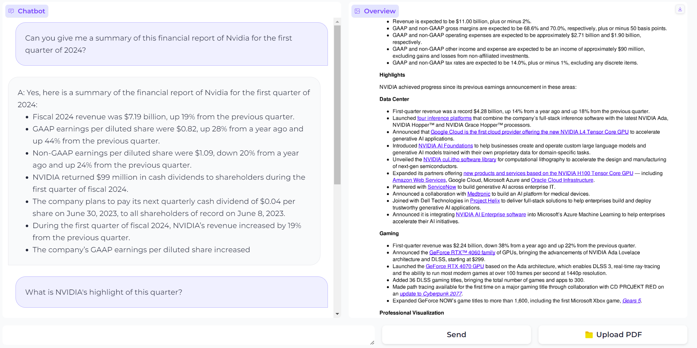

# Optimizing Financial NLP with Phi-2 through QLoRA and DPO:
This repository is the assignment of ELEC0141 Deep Learning and Natural Language Processing, UCL 2024

## Description:   
This project explores the enhancement of financial Natural Language Processing using the Phi-2 transformer model. By integrating  __QLoRA__ (Quantized Low-Rank Adaptation) for efficient fine-tuning and __DPO__ (Direct Preference Optimization) for aligning outputs with human preferences. Further enrichment is achieved through __RAG__(Retrieval-Augmented Generation) and Langchain, enabling document-based interactions. This study demonstrates significant improvements in processing financial data. 

`Used methods:`
- __QLoRA:__ For parameter-efficient fine-tuning, maintaining performance while reducing computational demands. [Paper Link](https://arxiv.org/abs/2305.14314)
- __DPO:__ Aligning model outputs with human preferences to improve relevance and applicability in financial scenarios. [Paper Link](https://arxiv.org/abs/2305.18290)
- __RAG:__ Enhancing document-based interactions through RAG and Langchain, facilitating dynamic responses grounded in financial documents. [paper link](https://arxiv.org/abs/2005.11401)

## Implementation Pipeline
`Model framework`    


`Models and Datasets:`
- Use QLoRA to fine-tune the model based on some [general QA datasets](https://huggingface.co/datasets/circircircle/generalQA). -> Model: ['GeneralQA-phi2'](https://huggingface.co/circircircle/GeneralQA-phi2)
- Use QLoRA to fine-tune the model based on [financial-specific QA datasets](https://huggingface.co/datasets/circircircle/FinQA). -> Model: ['FinQA-phi2'](https://huggingface.co/circircircle/FinQA-phi2)
- Use DPO optimization to align with human preferences based on [Intel/orca_dpo_pairs](https://huggingface.co/datasets/Intel/orca_dpo_pairs). -> Model:['FinDPO-Phi2'](https://huggingface.co/circircircle/FinDPO-Phi2)
- Use RAG and Langchain to link the optimized model with local documents and do the document-based chat.

`Training Hyperparameters:`   
- Supervised Fine-tune: general QA: rank=32, alpha=64 | FinQA: rank = 256, alpha=64   
- DPO: r=16, alpha=32   

## Results
### A. Financial QA Language Model   
more examples are shown here: [results](https://github.com/CIRCIRCIRCLE/DLNLP_24_SN23202440/blob/main/A_Finetune/results.txt)    
__Q: What are some signs that the stock market might crash?__
__GeneralQA:__  
Some potential warning signs of an impending stock market crash include a sudden and significant drop in stock prices, increased volatility or uncertainty in financial markets, high levels of investor anxiety or panic selling, negative economic indicators such as rising unemployment rates or falling GDP growth, geopolitical tensions or conflicts between major world powers, and large-scale corporate bankruptcies or defaults. Additionally, there may be other factors at play, including changes to government policies or regulations, shifts in consumer sentiment or spending habits, natural disasters or extreme weather events, or unexpected developments in global trade or supply chains. It is important for investors to stay informed about these various factors and monitor their investments carefully in order to make informed decisions and minimize risk during periods of market instability.

__FinQA:__     
There is no single sign or indicator of an impending stock market crash. However, there may be a combination of factors that could suggest increased risk for investors to consider before making investment decisions. These include:
1) High levels of volatility in the markets - if stocks and other securities experience large swings up and down over short periods of time, this can indicate heightened uncertainty about future performance which could lead to further declines.
2) Rising interest rates - when borrowing costs increase (such as through higher yields on bonds), it becomes more expensive for companies to finance their operations and invest capital into growth projects; additionally, rising rates often cause investor sentiment towards equities to become negative due fear associated with potential losses from equity investments during economic downturns caused by tightening credit conditions resulting from tighter monetary policy implemented by central banks like Federal Reserve Bank of United States (Fed).
3) Economic indicators such as GDP growth rate slowing significantly below expectations or unemployment numbers increasing sharply above forecasts would likely signal concerns among economists regarding near-term prospects for global economies including those here at home within North America region where Canada has been experiencing sluggish job creation while U.S. economy continues struggling despite recent upturn seen recently thanks largely due to fiscal stimulus measures taken earlier this year under President Donald Trump's administration.

__FinDPO:__     
There is no definitive answer to this question as predicting a stock market crash can be difficult. However, there are several indicators and warning signs that investors often monitor closely for potential downturns in the market. These include:
1) Rising interest rates - When interest rates increase, it generally makes borrowing more expensive which could lead to decreased consumer spending and lower corporate profits. This may cause stocks to decline.
2) Inflationary pressures - High inflation erodes purchasing power over time, leading consumers to spend less money on goods and services. Companies then experience declining sales, causing their share prices to drop.
3) Economic growth slowdown or recession - A slowing economy typically results from decreasing business activity due to factors such as reduced demand, increased unemployment, or falling incomes. As businesses struggle financially, they may cut costs by reducing capital expenditures (investments), laying off employees, or delaying hiring new staff. All of these actions negatively impact company earnings reports and investor confidence, potentially resulting in declines in stock prices.
4) Political instability - Uncertainty surrounding political events or policies can create an unstable environment for investing. 


### B. RAG-Based PDF Chatbot


## Code Guidance:
__requirements:__
```
pip install -r requirements.txt
```
__Use samples to test the trained models:__  
```
python main.py
```
### Data Preparation
```python
# For General Datasets Preparation
python Datasets/DataPreprocessing.py
# For Finance Specific Datasets Preparation
python Datasets/FinDataPrep.py
```

### A-Financial QA Language Model  
__Training:__ 
```python
# For GeneralQA Fine-tune
python A_Finetune/SFT.py --model_name "microsoft/phi-2" --dataset "circircircle/generalQA" --repo_name "circircircle/GeneralQA-phi2"   
# For FinQA Fine-tune
python A_Finetune/SFT.py --model_name "circircircle/GeneralQA-phi2" --dataset "circircircle/FinQA" --repo_name "circircircle/FinQA-phi2"
# For DPO Fine-tune
python A_Finetune/DPO.py
```
__Testing:__
```python
python A_Finetune/testSFT.py
python A_Finetune/testDPO.py  
```

### B. RAG-Based PDF Chatbot
__Training and Testing:__
```python
python B_RAG/app.py  # Model and Embedding are set in config.yaml
```
